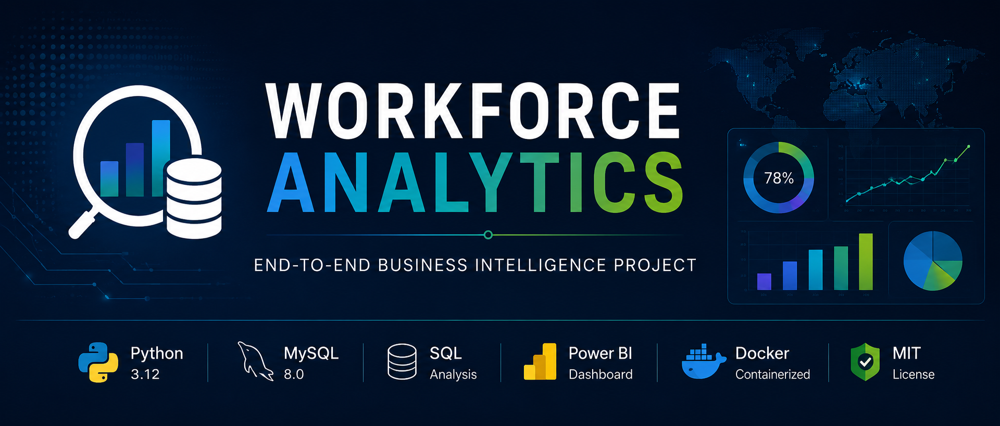
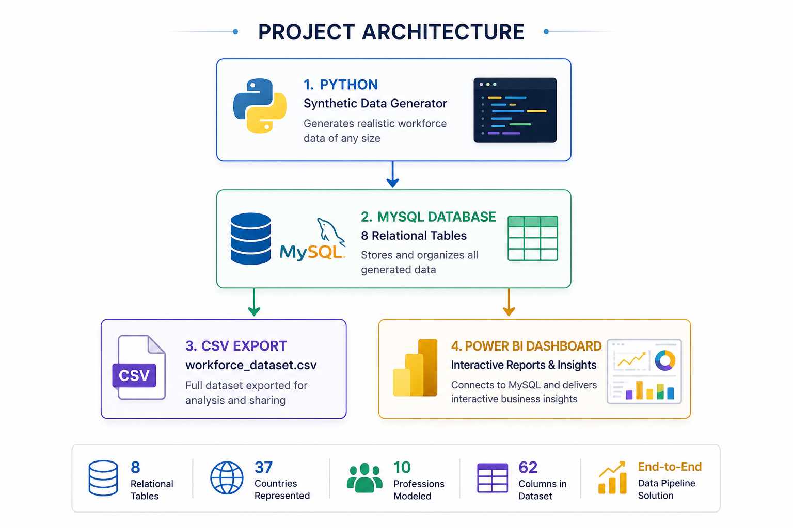
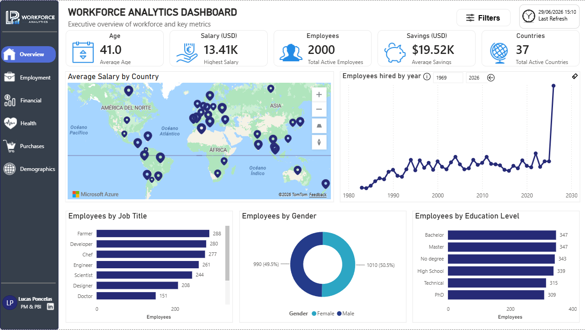
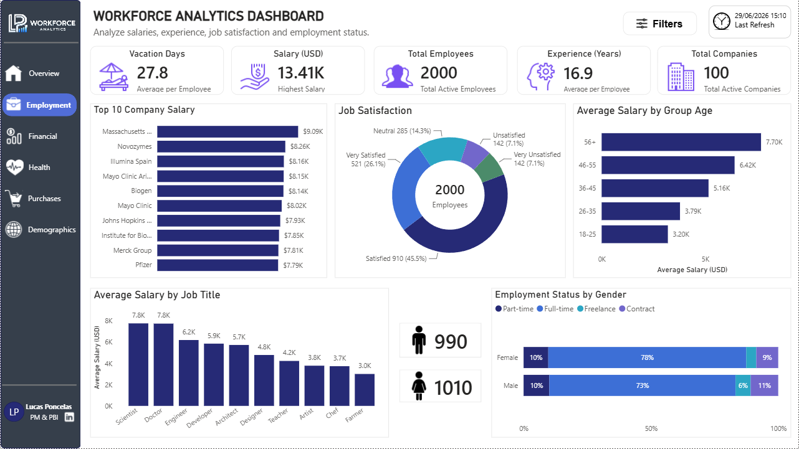
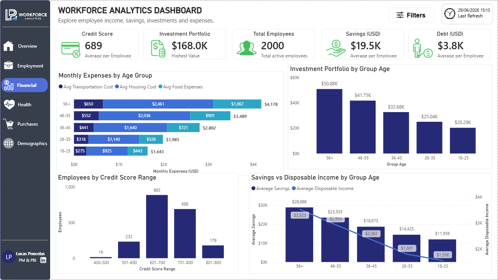
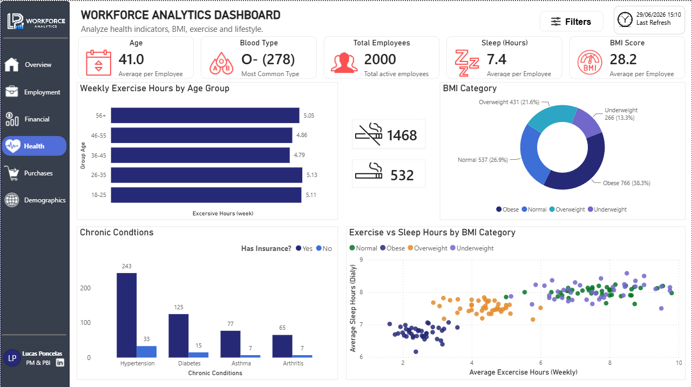
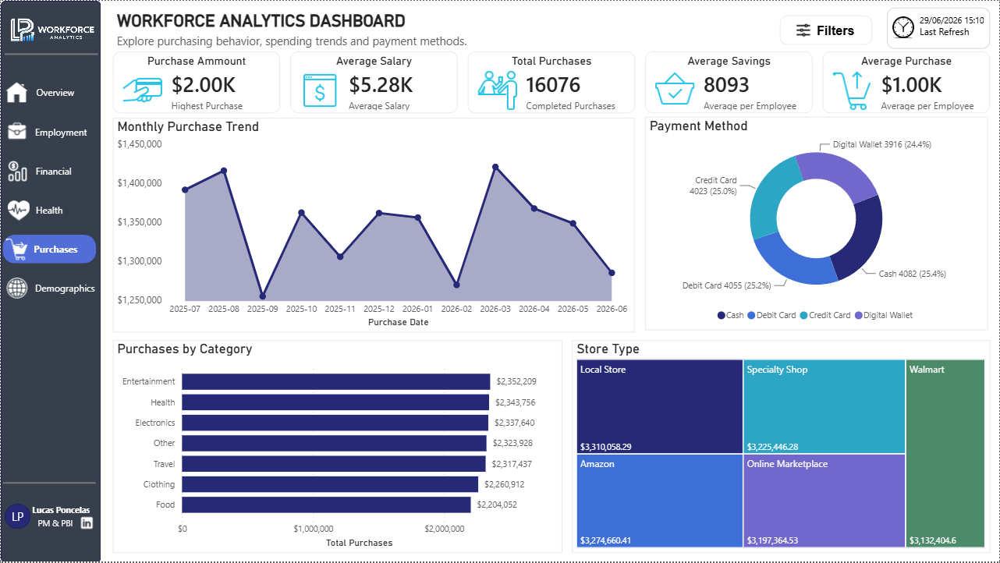
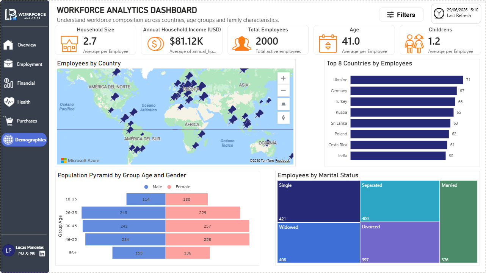

<p align="center">
  
</p>

# Workforce Analytics

### End-to-End Business Intelligence Project using Python, MySQL and Power BI

<p align="center">


</p>

---

## Project Overview

Workforce Analytics is an end-to-end Business Intelligence portfolio project designed to demonstrate practical skills in **Python, SQL, MySQL, Docker and Power BI**.

Instead of relying on public datasets, the project generates realistic synthetic workforce data, stores it in a relational MySQL database, performs SQL analysis and visualizes business insights through an interactive Power BI dashboard.

The application allows users to generate datasets of any size, automatically creates the database schema, populates every table with realistic information and exports the complete dataset to CSV.

---

## Table of Contents

- [Architecture](#architecture)
- [Key Features](#key-features)
- [Project Highlights](#project-highlights)
- [Dashboard Preview](#dashboard-preview)
- [Tech Stack](#tech-stack)
- [Project Structure](#project-structure)
- [Installation](#installation)
- [Usage](#usage)
- [Dataset](#dataset)
- [SQL Analysis](#sql-analysis)
- [Future Improvements](#future-improvements)
- [Author](#author)
- [License](#license)

---

# Architecture

The project follows a complete Business Intelligence workflow, from synthetic data generation to interactive reporting.

<p align="center">
  
</p>

---

# Key Features

- Generate realistic synthetic workforce data using Python.
- Store information in a relational MySQL database.
- Automatically create and populate database tables.
- Export the generated dataset to CSV.
- Interactive Power BI dashboard.
- Six analytical report pages.
- Drillthrough pages.
- Custom tooltips.
- SQL analytical queries.
- Dockerized MySQL environment.
- Modular Python architecture.
- User-defined dataset size.

---

# Project Highlights

| Highlight | Value |
|-----------|:------:|
| Programming Language | Python |
| Database | MySQL |
| Dashboard | Power BI |
| Dashboard Pages | 6 |
| Relational Tables | 8 |
| CSV Columns | 62 |
| Supported Countries | 37 |
| Professions | 10 |
| Dataset Size | User Defined |

---

# Dashboard Preview

The Power BI report is organized into six interactive pages, each focusing on a different business domain. Together, they provide a complete overview of the generated workforce dataset.

The report also includes **custom tooltips** and **drillthrough pages** to provide additional context and enable detailed navigation across the dashboard.

| Report | Description |
|---------|-------------|
| **Overview** | Executive summary with key workforce indicators and global metrics. |
| **Employment** | Salaries, professions, companies, experience and job satisfaction. |
| **Financial** | Savings, investments, debt, housing costs and credit score analysis. |
| **Health** | BMI, lifestyle, insurance, smoking habits and chronic conditions. |
| **Purchases** | Purchase trends, payment methods, categories and spending behavior. |
| **Demographics** | Geographic distribution, age groups, education and family composition. |

---

## Overview

Executive dashboard summarizing the most relevant workforce indicators, including employee distribution, salaries, education levels and geographic insights.

<p align="center">
    
</p>

---

## Employment

Employment analysis focused on salaries, company distribution, professional experience, vacation days, employment status and job satisfaction.

<p align="center">
    
</p>

---

## Financial

Financial overview including savings, investments, disposable income, debt, housing costs and employee credit scores.

<p align="center">
    
</p>

---

## Health

Health and lifestyle analysis covering BMI, sleep habits, weekly exercise, smoking, insurance coverage and chronic conditions.

<p align="center">
    
</p>

---

## Purchases

Purchase behavior analysis including payment methods, spending categories, stores and monthly purchasing trends.

<p align="center">
    
</p>

---

## Demographics

Demographic analysis showing workforce distribution by country, gender, age, marital status and household characteristics.

<p align="center">
    
</p>

---

# Tech Stack

The project combines multiple technologies and Python libraries to build a complete end-to-end Business Intelligence solution.

| Category | Technology | Purpose |
|----------|------------|---------|
| **Programming Language** | Python | Core application and synthetic workforce data generation. |
| **Database** | MySQL | Stores the relational workforce database. |
| **Containerization** | Docker | Provides a reproducible MySQL environment. |
| **Business Intelligence** | Power BI | Interactive dashboard and business reporting. |
| **Data Modeling** | DAX | Business calculations, KPIs and analytical measures. |
| **Data Transformation** | Power Query | Data transformation and preparation inside Power BI. |
| **Python Library** | Pandas | Exports relational data to CSV format. |
| **Python Library** | Faker | Generates realistic synthetic personal information. |
| **Python Library** | Mimesis | Generates localized synthetic data based on country. |
| **Python Library** | pgeocode | Retrieves postal codes and geographic coordinates. |

---

# Project Structure

```text
workforce-analytics/

├── dataset/
│   └── workforce_dataset.csv
│
├── docker/
│   └── docker-compose.yml
│
├── images/
│   ├── banner.png
│   ├── architecture.png
│   ├── overview.png
│   ├── employment.png
│   ├── financial.png
│   ├── health.png
│   ├── purchases.png
│   └── demographics.png
│
├── powerbi/
│   └── Workforce_Analytics.pbix
│
├── scripts/
│   ├── config.py
│   ├── constants.py
│   ├── database.py
│   ├── export.py
│   ├── generators.py
│   └── main.py
│
├── sql/
│   ├── 01_workforce_analysis.sql
│   ├── 02_financial_analysis.sql
│   ├── 03_health_analysis.sql
│   └── 04_purchase_analysis.sql
│
├── requirements.txt
├── README.md
├── LICENSE
```

---

# Installation

## 1. Clone the repository

```bash
git clone git@github.com:LucasPoncelas/workforce-analytics.git
cd workforce-analytics
```

---

## 2. Create a virtual environment

```bash
python3 -m venv .venv
```

Activate it:

**Linux / macOS**

```bash
source .venv/bin/activate
```

**Windows (PowerShell)**

```powershell
.venv\Scripts\Activate.ps1
```

---

## 3. Install dependencies

```bash
pip install -r requirements.txt
```

---

## 4. Start MySQL with Docker

```bash
cd docker
docker compose up -d
cd ..
```

This starts the MySQL container and automatically creates the `test_db` database.

---

## 5. Configure environment variables

Copy the example environment file:

```bash
cp scripts/.env.example scripts/.env
```

You can modify the database credentials if you prefer a different MySQL configuration.

---

## 6. Generate the dataset

```bash
python3 scripts/main.py
```

The application will:

- Create all relational tables.
- Generate synthetic workforce data.
- Populate the MySQL database.
- Export the complete dataset to CSV.

---

## 7. Open the Power BI report

Open `powerbi/Workforce_Analytics.pbix`.

If prompted, enter your local MySQL credentials and click **Refresh** to load the newly generated dataset.

---

# Usage

Running the application performs the following workflow:

```text
Start MySQL (Docker)
      │
      ▼
Connect to MySQL
      │
      ▼
Recreate database tables
      │
      ▼
Choose number of users
      │
      ▼
Generate synthetic data
      │
      ▼
Populate MySQL database
      │
      ├────────────► Refresh Power BI dashboard
      │
      ▼
Export workforce_dataset.csv
```

Each execution recreates the database tables, generating a completely new synthetic dataset. As a result, both the MySQL database and the exported CSV always remain synchronized.
```

---

# Dataset

The generated dataset combines multiple business domains into a single Business Intelligence solution.

The generated information includes:

- Personal information
- Geographic data
- Employment
- Education
- Financial indicators
- Health information
- Family information
- Purchase history

The dataset is completely synthetic and intended exclusively for educational and portfolio purposes.

---

# SQL Analysis

The repository includes SQL scripts covering different business domains and analytical scenarios.

- Workforce Analysis
- Financial Analysis
- Health Analysis
- Purchase Analysis

These scripts demonstrate SQL querying techniques including:

- JOIN
- GROUP BY
- ORDER BY
- Aggregate Functions
- Filtering
- Ranking
- Business KPIs

---

# Future Improvements

Possible future enhancements include:

- Automate database creation during project setup.
- Support incremental data generation without replacing existing records.
- Deploy the database in a cloud environment.
- Develop a Streamlit web interface for dataset generation.

---
# Author

**Lucas Catriel Poncelas Galeano**

This project was developed as part of my Business Intelligence portfolio to demonstrate practical experience in Python, SQL, MySQL and Power BI.

- **GitHub:** https://github.com/LucasPoncelas

- **LinkedIn:** https://www.linkedin.com/in/lucas-catriel-poncelas-galeano-68aa571a1/

---

## Acknowledgements

This project was developed for educational and portfolio purposes, demonstrating an end-to-end Business Intelligence workflow using synthetic data.

---

# License

This project is licensed under the MIT License.

See the **LICENSE** file for more information.